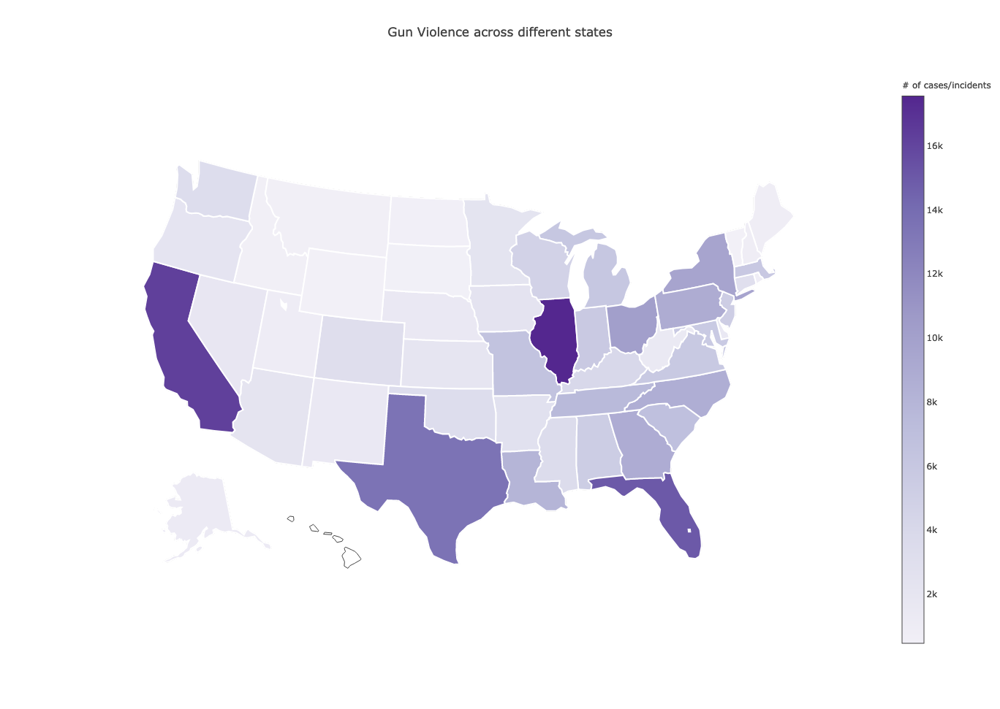
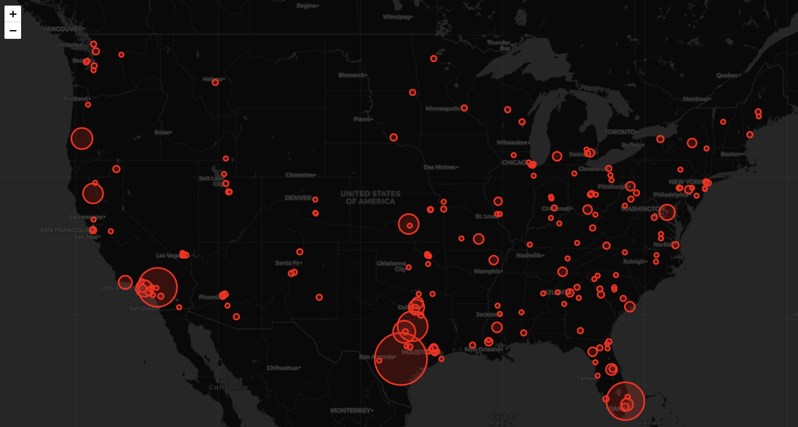

# ECE143-EDA-Gun_violence

## **Exploration of Gun violence in the US** 

### Motivation:

Gun violence in US causes many deaths. We would like to analyze the Gun violence dataset to explore location related trends and other characteristics such as firearm regulations and how they are being amended. We would also like to use the firearms provision, mental health, unemployment rate, mass shooting datasets to see if there is any correlation between them to the gun violence incidents across datasets.

### Dataset:

Below are the important datasets used:

#### [https://www.kaggle.com/jameslko/gun-violence-data](https://www.kaggle.com/jameslko/gun-violence-data) 

The dataset is a csv file of over 290,000 incidents across US from 2013-18 providing information such as number of people killed, hurt, type of gun used etc. 

#### [https://www.kaggle.com/jboysen/state-firearms](https://www.kaggle.com/jboysen/state-firearms)

The dataset is a CSV file providing information regarding firearms provisions is US from 1991-2017. 

#### [Mental Health Survey](https://osmihelp.org/research)

#### [Unemployment](https://www.kaggle.com/jayrav13/unemployment-by-county-us)

### Problem statement:

Our aim is to try and find correlation between gun violence dataset and other candidate datasets as mentioned above. We would like to explore and identify the most violent cities/states and confirm our hypothesis about the reasons from other datasets. Additionally, we plan to scrape data from the sources of reports to characterize the incidents.

###  	 Analysis	

Click here for interactive map: [HeatMap](https://plot.ly/~saideep91/2/gun-violence-across-different-states/#/) 

Click here for interactive map: [Radius Plot of Incidents](https://saideepreddy91.github.io/radius_plot.html)

